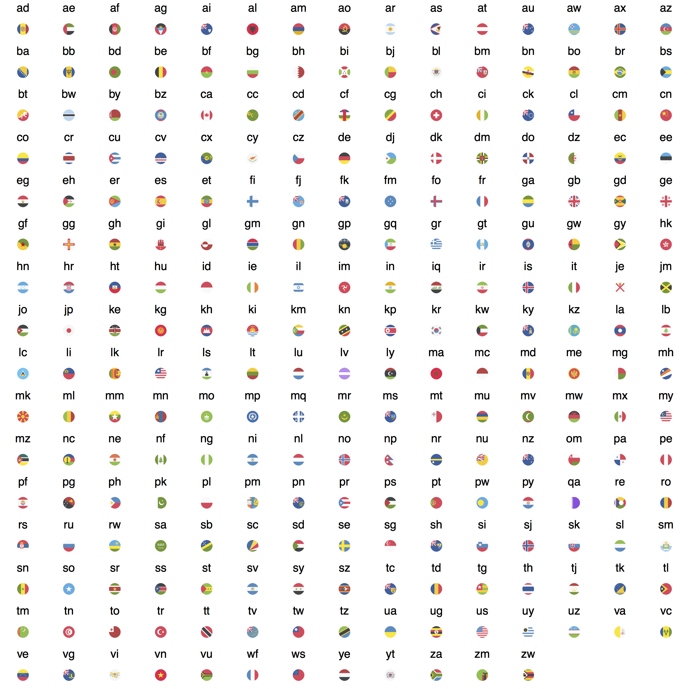

---
output:
  md_document:
    variant: markdown_github
---
## ggflags

flag geom for ggplot2

```{r demo}
library(ggflags)

set.seed(1234)
d <- data.frame(x=rnorm(50), y=rnorm(50), 
                country=sample(c("ar","fr", "nz", "gb", "es", "ca"), 50, TRUE), 
                stringsAsFactors = FALSE)
ggplot(d, aes(x=x, y=y, country=country, size=x)) + 
  geom_flag() + 
  scale_country() +
  scale_size(range = c(0, 15))
```

The flag SVG assets, used under the [CC-BY licence](https://github.com/eosrei/emojione-color-font/blob/master/LICENSE-CC-BY.txt), are taken from the EmojiOne set: https://github.com/eosrei/emojione-color-font



(note: proof of principle only)


