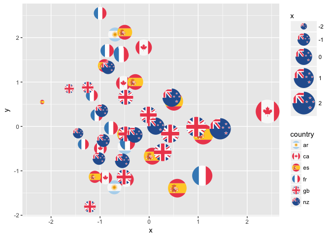

ggflags
-------

flag geom for ggplot2

``` r
library(ggflags)

set.seed(1234)
d <- data.frame(x=rnorm(50), y=rnorm(50), 
                country=sample(c("ar","fr", "nz", "gb", "es", "ca"), 50, TRUE), 
                stringsAsFactors = FALSE)
ggplot(d, aes(x=x, y=y, country=country, size=x)) + 
  geom_flag() + 
  scale_country() +
  scale_size(range = c(0, 15))
```



The flags are taken from wikipedia via <https://github.com/behdad/region-flags>


(note: proof of principle only)
